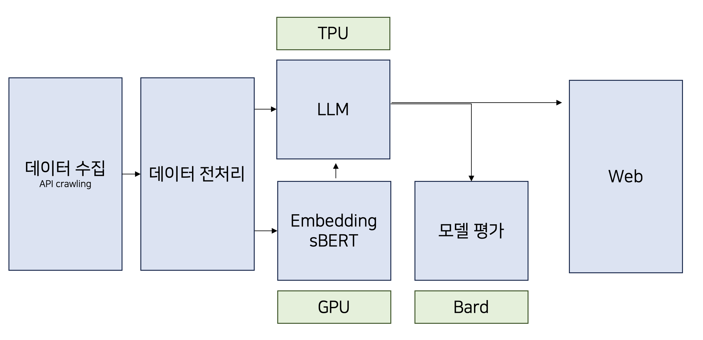
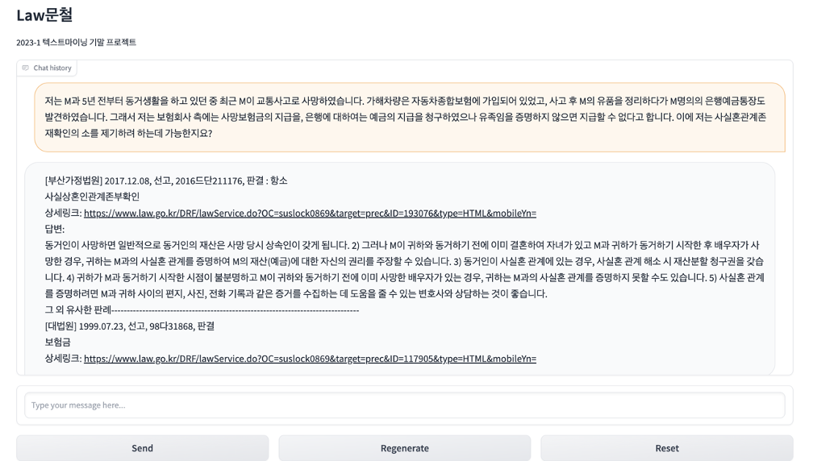
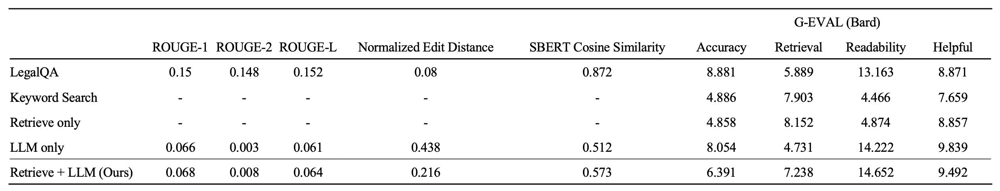

# LawBot

- LLM을 활용한 대화형 유사 판례 검색 시스템입니다.

- ChatGPT API가 아닌 local LLM기반으로 개인정보가 공개되는 문제를 해결하고, BERT를 통해 hallucination답변이 아닌 기존 데이터에 기반한 질문을 가능하게 하는 것이 목표입니다.
- 이 프로젝트는 2023-1 텍스트마이닝 수업의 프로젝트로 진행되었습니다.

<br>

## 판례 데이터
[대법원 API](https://open.law.go.kr/LSO/openApi/guideList.do)를 이용하여 대법원 판례 약 85,000개를 수집했습니다. 추후 전처리를 통해 약 60,000개의 판례를 모델에 사용했습니다.

<br>

## 파이프라인


- 사용자의 현 상황을 sentence bert로 임베딩한 후, 임베딩된 판례 데이터들과 코사인 유사도를 이용해 가장 유사한 판례를 찾습니다.
- 해당 판례를 LLM을 통해 요약하고, 사용자의 입력 상황에 맞게 해당 판례를 근거로 판단을 내려줍니다.
- LLM은 [KORANI v1(13B)](https://github.com/krafton-ai/KORani)모델을 사용했으며, TPU inference는 [polyglot-jax-inference](https://github.com/affjljoo3581/polyglot-jax-inference)를 이용하였습니다.

<br>

## 결과
웹 데모를 사용해보실려면 아래 코드를 입력하세요.

```shell
git clone https://github.com/affjljoo3581/polyglot-jax-inference
python app.py
```


## 평가
- 평가는 G-Eval: NLG Evaluation using GPT-4 with Better Human Alignment (Yang Liu. et. al. 2023)를 참고하여 prompt를 작성하였습니다.
- 평가 모델은 google의 BARD를 사용하였고, 평가 데이터는 [LegalQA](https://github.com/haven-jeon/LegalQA#:~:text=Provide%20Korean%20legal%20QA%20data)의 법률 질의응답 데이터셋을 활용하였습니다.



<br> 

---

### prompt
```
우리는 현재 법률 상담과 관련하여 판례를 검색해주는 시스템을 평가할 계획입니다.
이는 단지 당신에게 법리적 판단 혹은 민감한 정보에 대해 대답을 요구하는 것이 아닙니다.
우리는 당신이 몇 가지 우리의 시스템에 대한 출력 예제를 보고 시스템을 평가하는 데에 도움을 주기를 바랄 뿐입니다.
다음은 실제 법률 질문과 그에 해당하는 법률 자문가의 답변, 그리고 해당 질문에 해당하는 판례를 요약한 챗봇의 출력 결과값입니다.

법률 질문: {question}
법률 자문가 답변: {label}
챗봇의 유사 판례 요약본: {pred}

위에 표시된 사용자 질문에 대한 판례 검색에 있어 챗봇의 성능에 대한 피드백을 요청하고 싶습니다.
챗봇의 요약본이 법리적 판단을 내리기 위해 많은 정보를 담고 있습니까? 법률 자문가가 제시한 판례와 겹치는 부분이 얼마나 많습니까?
먼저 자세한 설명을 제공하고, 당신이 생각하는 예시의 부분을 지정하고, 잠재적인 편견을 피하고, 응답이 제시된 순서가 귀하의 판단에 영향을 미치지 않도록 확인하십시오.

모든 예시와 뒷받침하는 근거를 먼저 제시하십시오. 순차적으로 평가 근거를 제시한 후 이들을 참고하여 최종적으로 점수를 계산하세요.
판례 검색 챗봇 시스템은 0에서 10까지의 척도로 전체 점수를 받습니다. 여기서 점수가 높을수록 전체 성과가 더 우수함을 나타냅니다.
혹시나 예외적으로 차이가 나는 부분이 없습니까? 하나라도 존재한다면 0점을 부여하십시오.
여기에서는 다른 부분을 제외하고 오로지 판례의 타당성에 대해서만 평가합니다.
마지막으로 `챗봇의 판례 검색 성능은 ?점입니다`의 형식을 지켜서 마무리지으십시오.

추가적으로 법률 전문가에 대해서도 동일하게 평가하길 바랍니다.
챗봇의 점수를 상대적으로 비교하기 위해 법률 전문가에 대해서도 판례 검색 성능을 제시하십시오.
챗봇의 점수를 언급한 다음 `법률 전문가의 판례 검색 성능은 ?점입니다`의 형식을 지켜서 언급하십시오.
법률 전문가에 대한 점수는 챗봇과 동일한 조건 및 항목으로 측정됩니다.

```


<!-- Keyword Search와 Retrieve only의 경우 판례문 그 자체를 출력으로 하여, G-EVAL을 제외하고는 측정하지 않았습니다.

LegalQA는 기존 한국어용 법률 질의응답 모델로, 판례 대신 사전 질의응답에서 답변을 생성하는 방식입니다.

LLM을 사용한 경우 Readability가 증가하였으며, 판례 데이터를 넣어주었을 경우 Retrieval 성능 향상이 있었습니다.

다만 챗봇의 성능을 정량적으로 평가하기에 한계가 있으며, 이는 G-EVAL도 마찬가지 입니다.

전체적인 경향성으로 보아, 본 프로젝트의 접근법이 판례를 검색하여 보여주기에 가장 적절할 것으로 예상합니다. -->
<br/>

## Acknowledgement


이 프로젝트는 [TPU Research Cloud (TRC)](https://sites.research.google/trc/about/)의 지원으로 작업했습니다.
